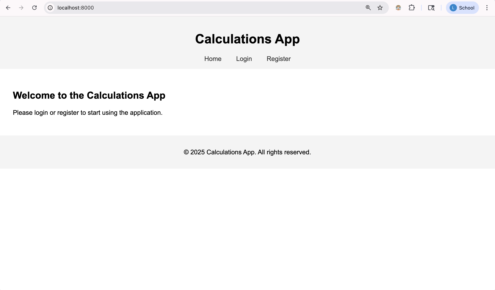
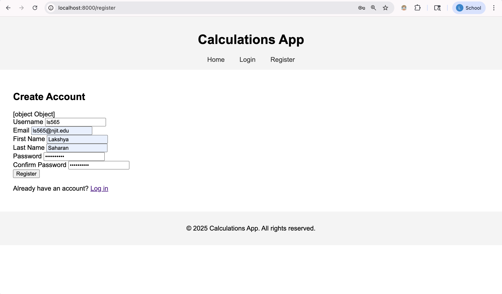
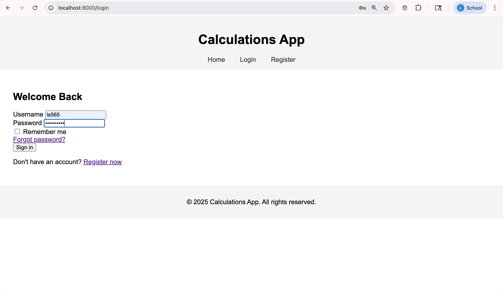
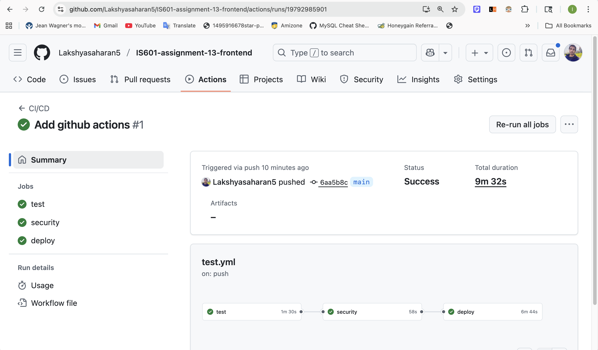
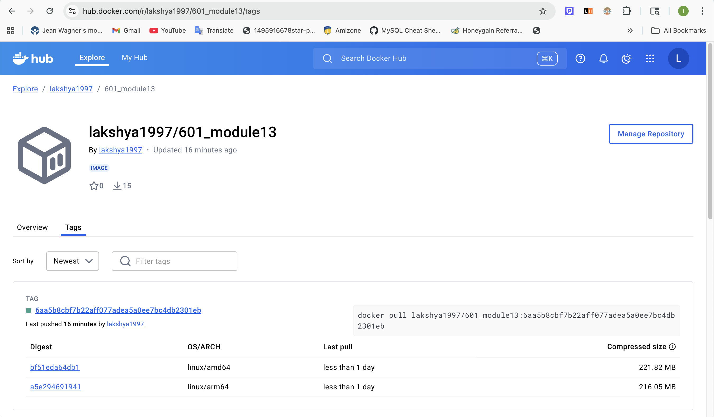

# IS601-assignment-13-frontend

User authentication frontend

## Application screenshots








## Github Workflow Action Pipeline



## DockerHub Deploy

URL: <a href="https://hub.docker.com/r/lakshya1997/601_module13/tags">https://hub.docker.com/r/lakshya1997/601_module13/tags</a>



## Running tests

Be sure to create a pytest.ini file to specify the test directory paths and any additional Pytest configurations.

```bash
# Playwrite install
$ pip install playwright
$ pytest

# Run integration tests
$ pytest tests/integration/

# Run end-to-end tests
$ pytest tests/e2e/

# Run unit tests for operations
$ pytest tests/unit/

# Run all tests (including those configured in conftest)
$ pytest
```

```bash
========================== test session starts ==========================
platform darwin -- Python 3.10.19, pytest-8.3.4, pluggy-1.5.0
rootdir: /Users/lakshyasaharan/projects/IS601/module-13/module13_is601
configfile: pytest.ini
testpaths: tests
plugins: cov-6.0.0, Faker-36.1.0, anyio-4.8.0
collected 100 items                                                     

tests/e2e/test_fastapi_calculator.py ............                 [ 12%]
tests/integration/test_calculation.py .............               [ 25%]
tests/integration/test_calculation_schema.py ........             [ 33%]
tests/integration/test_database.py ....                           [ 37%]
tests/integration/test_dependencies.py .....                      [ 42%]
tests/integration/test_schema_base.py ............                [ 54%]
tests/integration/test_user.py ........s....                      [ 67%]
tests/integration/test_user_auth.py ............                  [ 79%]
tests/unit/test_calculator.py .....................               [100%]

--------- coverage: platform darwin, python 3.10.19-final-0 ----------
Name                         Stmts   Miss  Cover   Missing
----------------------------------------------------------
app/__init__.py                  0      0   100%
app/auth/__init__.py             0      0   100%
app/auth/dependencies.py        28      4    86%   37, 52-65
app/auth/jwt.py                 60     27    55%   46, 58, 76-77, 90-127, 141-161
app/auth/redis.py               13      7    46%   8-12, 16-17, 21-22
app/core/__init__.py             0      0   100%
app/core/config.py              20      0   100%
app/database.py                 17      4    76%   16-20
app/database_init.py             7      0   100%
app/main.py                    128    128     0%   1-272
app/models/__init__.py           0      0   100%
app/models/calculation.py       92      7    92%   95, 98, 116, 125, 139, 141, 153
app/models/user.py              94     10    89%   48, 65-68, 73, 160, 226, 229-230
app/operations/__init__.py      16      0   100%
app/schemas/__init__.py          4      0   100%
app/schemas/base.py             24      0   100%
app/schemas/calculation.py      53      4    92%   47, 50-51, 95
app/schemas/token.py            32      0   100%
app/schemas/user.py             66     20    70%   53-55, 60-71, 184-188
----------------------------------------------------------
TOTAL                          654    211    68%
Coverage HTML written to dir htmlcov


===================== 99 passed, 1 skipped in 7.63s =====================
```

## Challenges

#### User registration issues

I think we might need to create database and tables manually for the authentication to work because docker seems to create test db only. Although logs do print that tables are created but not sure. 

#### Package issues

- Redis dependency is deprecated in Python 3.13. I installed Python@3.10 and created new venv for redis and jwt tests to clear.

- bcrypt lib also causes issues so added specific version in requirements.txt which works with Passlib

#### Security patch issue

Security action workflow fails when running Tivy vulnerability scanner. 
To fix this, I added .tiryignore files with following Vulnerabilities:

- CVE-2025-43859
- CVE-2024-33663
- CVE-2025-62727


